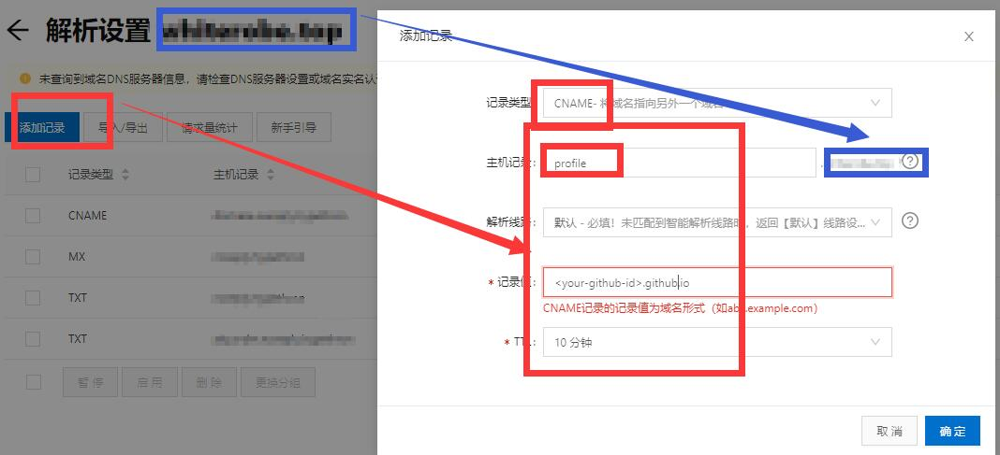

# 从零开始的建站教程

> 编撰过程难免会有错误和遗漏，请feel free to `pull request`，帮助我进行斧正、添加内容。

## 基本概念

### 网站结构

我们常说的网站一般会分为两个部分：

- **前端**：在早年间主要指的是静态的UI界面，随着现代前端的发展，逐渐开始覆盖原有的后端业务；
- **后端**：与数据库的交互等需要中央集成的，随着后端开发技术的发展，后端出现虚拟化的趋势，如RESTful等技术，直接将原本的后端业务伪装成“文件”以供泛前端应用的调用；

但无论如何，我们访问到的任何一个网站，其数据文件都存储在一台“服务器”上。如果这台服务器暴露在公网之下，作为约定，在本篇文章中我们仅将这种情况下的“服务器”称为一台服务器——也就是说，我们暂且不讨论局域网内的服务器。

> 而所谓“暴露在公网之下”，指的是这台服务器有一个全球唯一的IP地址，而不是`192.xxx.xxx.xxx`这类常见的内网地址。关于内外网IP地址和保留地址的划分，请自行百度。

### B/S架构的前后端分离

前后端分离的概念比较大，历史也比较悠久，我们抽简要的说。

- 网站开发方面(B/S)，以【JSP】为例，写过它的同学一定会记得`<% System.out.println("Hello World") %>`这种控制语句写得整个页面都是，非常视觉污染，同时要开发一个网页要同时会写JAVA、JavaScript，既当爹又当妈；而且如果代码质量不高，写这个页面的程序员跑路之后整个项目就会变成一座屎山，根本没人维护得来。有时候我们也把这种开发方式称为服务端渲染(SSR)。

- 相对的，现在存在另外一种设计模式——单页面应用(SPA)。直观上理解，我们把前端的UI界面仿照C/S架构进行设计，即服务器将要给用户呈现的动态数据通过JSON等数据格式交给前端，前端再通过JS操作DOM完成页面的渲染。前后端的代码开发范围绝不重合，二者的唯一交互内容只有“协议通信接口”(或我们常说的API)。

这么说有点绕，我们画个图：

未前端分离：

	

前后端分离：

	

某种意义上我们基于B/S实现了C/S要做的事。

> 注：SSR和SPA并不是区分是否前后端分离的标准。

> 这里要感谢微软设计的AJAX，给前后端解耦提供了一种新的思路。请自行了解，不要只关心JQuery怎么调AJAX的API，要去理解它的设计思想。
> **AJAX = Asynchronous JavaScript and XML**

### 缓存技术

到这里一定会有一个疑问：每次访问一个网站都要临时拉取一个应用，岂不是会导致“网站打开的速度很慢”？

理论上是的，但是9102年了，个人联网设备的性能和网络通信速度都比较高了，临时在B端构建一个应用的代价并不会特别高；其次是现代前端、后端弄了很多奇技淫巧来提高这个过程的加载速度，例如PWA和Chrome Cache直接把一个网站的前端应用缓存到本地，每次打开一个打开过的网站时会基于差分技术比对不一样的地方，然后仅下载、加载发生变动的模块。

- 直观上进行理解和解释，浏览器帮你像安装一个桌面应用一样把一个SPA安装到浏览器内部；每次打开网站时都执行一次类似“客户端更新”的操作，这样即保证了前端应用的打开速度也保证了前端应用的有效性。

还有一个问题，如何保证第一次打开一个网站时和后期“更新”操作的可靠性。

另一个方面，基于OSS、CDN等技术，使得我们从全世界任意一个地方的服务器的文件系统获取前端应用的文件变得非常快速。

> - 我们会在活动时手动来实操这些东西。

### DNS、IP、端口和Domain

现在，我们对访问一个网站的流程要有一个直观上的理解：

1. 有一台服务器存放着网站所需的各种文件；
2. 它有一个全球唯一的IP，使得任何接入互联网的人都可以通过这个IP找到这个服务器；
3. 这个服务器可能除了存放网站所需的各种文件，还有其它对外开放的需求；所以约定某个端口(比如80端口)专门用于某个网站系统的对外通信；
4. 通过`IP:端口`的形式访问这个服务器，拉取网站文件；
5. 但是，这个IP太拗口了谁特喵记得住？于是我们约定一个域名(domain name)来标记这个IP，访问这个域名就等于直接访问这个IP，也就是这个服务器；

整个流程链条如下：

`用户`-`域名(可选)`-`IP+端口`-`服务器在该端口开放的文件系统`-`网站应用的各类数据`

### 域名与DNS解析

IP、端口都非常容易理解，重点要说一下域名和DNS；

**① 域名(Domain Name)**

域名从【最后一位】开始读，我们以`www.github.com`举例子：

1. `com`在最后一位，是【顶级域名】(Top-level domains，TLDs)；

我们常见的`com`就是`commerce`的缩写，一般商业机构进行申请的；还有很多各种各样的域名，它们各自的意义你可以自行百度到。

特别的是，例如`xxxx.com.cn`、`xxxx.gov.cn`的域名，我们一般也把`.com.cn`认为是顶级域名；这个跟国家有关，一般人买不到也买不起。（我习惯把这种情况叫`.gov`和`.com`为一级域名）

顶级域名都是定好的，作为普通人我们只能选择一个而不能自定义。

2. `.github`是二级域名(SLD，second-level domain)；

比较特殊的，按照我个人习惯我会自动忽略把它称为“一级域名”的说法，具体说法的出处我也记不清了；反正每年看教材都有变化，不用太细究。

我们申请域名时能够自定义的就是这个位置的域名，是**我们需要重点关注**的内容。

可以开放申请的就是从二级域名往上的域名(子域名)，我们申请时只要获得二级域名，其后的所有域名不需要再次申请，统统交由DNS系统自行注册申请。

3. `www`是主机名，有时候也叫记录名。大部分情况下，不管域名多长，除二级域名之外，排在最前面的就是主机名。

大部分情况下一个网站把主机名写为`www`并没有什么特别的业务需求或协议需求，往往就是习惯的操作和纪念性的操作而已。

**② 域名系统/网域名称系统(Domain Name System)**

据说全球只有13台DNS根服务器(全放在美帝)，大部分情况下你无法接触到这些DNS根服务器，它们只接收区域性的ISP访问；

你的网络提供商(在中国就是电信、移动和联通)搭建了它们的DNS服务器，帮助你转交你的域名解析请求。这些服务器的IP大部分情况下你的网络提供商（ISP）自动提供——比如用电信、校园网进行PPPOE拨号时，都是自动获取或DHCP得到的。

以访问`www.github.com`为例子：(我们假设现在所有的DNS服务器里都没有缓存数据)

1. 由于我们大部份人没有自己的DNS服务器，我们ISP的DNS服务器作为例子；
2. 首先解析`.com`，电脑从ISP处得到它DNS服务器的IP，然后向该ISP的DNS服务器发送解析请求；由于此时不存在缓存数据，因此ISP的DNS服务器会向上级——也就是根服务器转发请求；
3. ISP得到根服务器的回应，询问记录了`.com`的服务器知不知道`.github`的IP存在哪里；
4. (开始无限递归，直到查询到主机名，在本例子中，实际上到第三步就已经结束DNS的查询过程)
6. 得知`github.com`的ip为`185.199.108.153`，于是我们实际上访问的是`http://185.199.108.153:80`；(80是默认端口，因此可以直接省略)

你一定会问`www`呢？还有个主机名呢？

### 记录

正如前文说过的，主机名实际上是个非常无所谓的值，我们访问一个网址重要的是IP，只要我们愿意，我们可以把任意主机名映射到同一个IP上。

那么该怎么做这种主机到IP的影射呢？我们接下来要说两个比较重要的DNS记录值。

假如我们现在买了一个域名：`xdtic.club`，但是还没有分配它的ip和主机名。

**A记录和AAAA记录**：指向一个IP。(A: Address Record)

我们以域名`xdtic.club`为例子，当我设置了一个A记录，标记了主机名为`www`，IP为`222.25.173.22`，那么，当我们访问`www.xdtic.club`时就会跳转到`222.25.173.22`。

	

而AAAA和A的区别就在于前者指向一个IPv6地址而后者指向IPv4。

> 注意:你也可以直接把域名`xdtic.club`映射到某个IP而不添加任何主机名。规则如下:

	

**CNAME**：别名记录，指向一个域名。(CNAME: Canonical Name Record)

还是以域名`xdtic.club`为例子，我们添加一个主机名`io`作为CNAME，映射域名为`whiterobe.github.io`，假设`whiterobe.github.io`会被解析为IP`185.199.108.153`，那么域名`io.xdtic.club`就会被二次映射到`185.199.108.153`。

	

> 还有很多种DNS记录值，但其它的记录值我们暂时不关心。

## 练习：建立一个网站

现在，我们要从零开始建立一个运行在公网之上的静态网站(个人简历站)，最终效果为：

	

当然，作为一次练习，我们的目标是不花一分钱。

### Github Pages

首先，我们要解决一下服务器的问题。

上面我们说过，一个网站需要一个运行在公网之上的服务器，我们需要把网站相关的文件存储到这台服务器上，这个接入互联网的用户才能访问到这个网页。

最直接的方法是去阿里云、腾讯云等云服务器商购买一台服务器；但我们的目标是不花一分钱，因此我们可以借助Github的服务器。

因此，你需要了解一下<a href="https://github.com/WhiteRobe/2019TICWebsiteTrain/blob/master/articles/github_pages.md" _blank="target" rel="openner">Github Pages</a>。

非常简单，基本上按照上文的指引来都能完成；不过我们需要进行一些酷炫的操作。

1. 在Github上创建一个库，[下载简历模板](https://github.com/WhiteRobe/TIC2019GitTrain/blob/master/template/templated-privy.zip)，push到这个仓库。(你可以做一些小修改)
2. 创建Github Pages。
3. 稍等三分钟，访问`https://<your-github-id>.github.io/<repo-name>`，你就会看到你的简历被post到公网之上了。
4. 你之后可以修改简历，然后push到这个仓库，再刷新页面，你的简历页面就变了。

> 如果你对前端熟悉，你甚至可以编写一些更酷炫的站点！这里我推荐一个静态页面设计网站：[https://templated.co/](https://templated.co/)！免费！好看！收藏夹！

### CDN加速

你一定会发现一个问题，如果借用的是Github的服务器，访问速度就非常慢；解决方案有很多，比如利用国内的Gitee来取代Github，或者是我们需要重点推荐的CDN。

CDN，内容分发网络，我简要介绍一下这个东西：

- 直观上理解，如果服务器在国外，由于光的速度总是优先的，加上路由跳点等等等问题，当你访问一个与你相隔非常远的服务器，实际上速度是非常低的。CDN服务公司会在全球修建各类站点，当你在中国访问了美国的服务器，第一次访问可能会非常慢，但是CDN网络会把数据拉取到你附近的服务器上，下次访问你就会获得更快的速度。

你可能想问，我的浏览器不也能缓存么？那我要CDN做什么。

CDN牛逼的地方不只是在你访问时能缓存，你身边的某个人访问过这个站点，他附近的人都能得到缓存的加速BUFF。

同样，你可以到阿里云、腾讯云购买CDN服务，半年十几块钱，相当便宜。但我这里推荐一个不收费的国际顶级CDN服务商：[CloudFlare](www.cloudflare.com)，注册只需要一个邮箱即可。

但在此之前，我们需要一个域名，并且知道如何解析一个域名。

### 购买域名

> 之所以需要购买域名的原因在于CDN需要自定义DNS，因此你需要拥有一个自己的域名才能控制由哪个DNS来解析这个网址。

要用CDN加速，你需要购买一个域名，很便宜，阿里云或者腾讯云委托购买，9￥一年。

以阿里云为例子：

当你购买一个域名之后，你会在控制台看到你的域名：

	

阿里云购买的域名，阿里云默认提供了国内的DNS服务器为你解析这个域名，我们现在这里学习如何解析DNS并绑定到刚刚建立的Github。点击解析，会进入阿里云的DNS服务(阿里云提供了免费的解析服务)：

	

进入解析界面：

	

我们选择CNAME，把你的域名映射到你的Github Pages。(还记得CNAME是域名到域名的映射吗？)

例如你买的域名是`cool.top`，这里的主机记录填的是`profile`，那么`profile.cool.top`就会被映射到`<your-github-id>.github.io`。

### 自定义Github Pages

我们实际上并不太喜欢`<your-github-id>.github.io`这样的域名，显得很Low，我们想用我们购买的域名替代Github给我们分配的域名，该怎么做呢？

现在，给你的Github Pages填写刚刚做好CNAME记录的域名：`profile.cool.top`：

	

> 理论上，Github会为我们默认生成一次`commit`，在仓库的index.html同级地址下添加一个`CNAME`文件，用以指示映射别名。(这是Github的特殊环境需求，其它系统可能没有)
> 最好我们手动建立一个`CNAME`纯文本文件在仓库中，内容就是`profile.cool.top`，然后PUSH到Github仓库。

喝杯咖啡，你就会发现，访问`https://profile.cool.top`会看到刚刚访问`https://<your-github-id>.github.io/<repo>`的页面。

### 内容分发网络

说了一大圈，我们终于要回到CDN了。

首先，我们需要打开CloudFlare，进入控制台：

	

我们回到我们的ISP的页面(比如我们从阿里云购买了域名，那就是阿里云)，我们需要修改解析这个域名的DNS。(之前提过阿里云给我们默认分配了它的DNS服务器)：

	

点击【管理】，然后你会看到：

	

修改为CloudFlare的DNS服务器。我们需要等待全球DNS刷新记录，一般半个小时到一天，看运气。

然后在CloudFlare的DNS控制台配置CNAME，和刚刚在阿里云配置的差不多。

在以上过程完成后，我们可以尝试ping一下你的域名，你会发现这时不再是直接访问Github的服务器IP了(185.199.108.15*)，而是CloudFlare的加速网络。

让我们再在[站长之家](http://tool.chinaz.com/speedtest/)看一下效果：

	

祖国河山一片绿，加速效果还是非常明显的。

